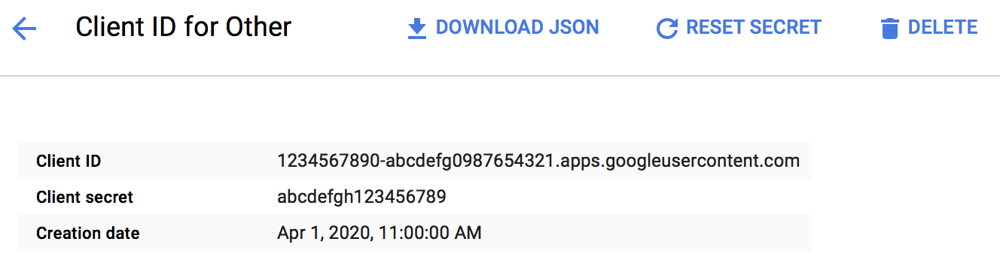

# Air Strings

Air Strings is a command-line tool for translating localizable strings in Google Sheets.

# Building

In order to build an executable you need a client identifier and a secret for Google Sheets API. Please follow instructions at [https://developers.google.com/sheets/api/guides/authorizing#OAuth2Authorizing](https://developers.google.com/sheets/api/guides/authorizing#OAuth2Authorizing) to generate something like this:



Once generated, copy and replace string values `CLIENT_ID` and `CLIENT_SECRET` in the following script:

```bash
git clone git@github.com:CirkusApp/airstrings.git && cd airstrings
CLIENT_ID=1234567890-abcdefg0987654321.apps.googleusercontent.com CLIENT_SECRET=abcdefgh123456789
echo "GCC_PREPROCESSOR_DEFINITIONS = \$(inherited) AIR_GOOGLE_SHEETS_CLIENT_IDENTIFIER=$CLIENT_ID AIR_GOOGLE_SHEETS_CLIENT_SECRET=$CLIENT_SECRET" > AirSecrets.xcconfig
swift package generate-xcodeproj --xcconfig-overrides AirSecrets.xcconfig
xcodebuild -project airstrings.xcodeproj -target airstrings -configuration Release
cd build/Release
```

# Running

Read a manual by performing the following command:

```bash
build/Release/airstrings
```

# Roadmap

- Write `make build` with `swift build` which gets `.xcconfig` parameters via `-Xcc`
- Release a binary for public to add support for `brew install airstrings`
- Use [OysterKit](https://github.com/SwiftStudies/OysterKit) for parsing `.strings`
- Add support for parsing `.properties` using `OysterKit`
- Open the website Cirkus Open Source at [https://cirkusapp.github.io](https://cirkusapp.github.io)
- Move Air Strings to [https://cirkusapp.github.io/airstrings](https://cirkusapp.github.io/airstrings)
- Build API URLs using [URITemplate.swift](https://github.com/kylef/URITemplate.swift)
- Describe output format using [Stencil](https://github.com/stencilproject/Stencil) or the like
