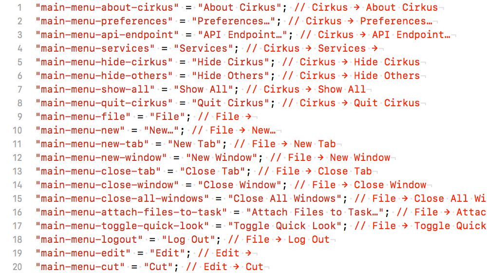

# Air Strings

Air Strings is a command-line tool for translating localizable strings in Google Sheets.

### 1. Prepare localization as Localizable.strings

Tis is usually done in Xcode or AppCode. The preferred format is `"key" = "value"; // comment` 🤷‍♂️



### 2. “Push” Localizable.strings to Google Sheets

The command like `airstrings push --path en/Localizable.strings` will upload key-value pairs with their comments into the Google spreadsheet.


### 3. Translate strings using Google Sheets

Then you translate strings into any language. By the way, Google Sheets are perfect for collaboration!


### 3. “Pull” translations as Localizable.strings

Once translation is done, download all strings back using a command like `airstrings pull --path ru/Localizable.strings`.


####  🎉 Done!

# Building

In order to build an executable you need a client identifier and a secret for Google Sheets API. Please follow instructions at [https://developers.google.com/sheets/api/guides/authorizing#OAuth2Authorizing](https://developers.google.com/sheets/api/guides/authorizing#OAuth2Authorizing) to generate something like this:


Once generated, copy and replace string values for `CLIENT_ID` and `CLIENT_SECRET` in the following script:

```bash
git clone git@github.com:CirkusApp/airstrings.git
cd airstrings

CLIENT_ID=1234567890-abcdefg0987654321.apps.googleusercontent.com
CLIENT_SECRET=abcdefgh123456789
echo "GCC_PREPROCESSOR_DEFINITIONS = \$(inherited) \
	AIR_GOOGLE_SHEETS_CLIENT_IDENTIFIER=$CLIENT_ID \
	AIR_GOOGLE_SHEETS_CLIENT_SECRET=$CLIENT_SECRET" > \
	AirSecrets.xcconfig

swift package generate-xcodeproj \
	--xcconfig-overrides AirSecrets.xcconfig
xcodebuild \
	-project airstrings.xcodeproj \
	-target airstrings \
	-configuration Release
```

# Running

At the moment Air Strings is available only after building manually:

```bash
build/Release/airstrings <command> [options]
```

Once the app is ready for public, we’ll probably publish at [Brew](https://brew.sh).

# Roadmap

- Renew access token when it’s expired
- Improve error messages by overriding `AirStrings.Error.localizedDescription`
- Write `Makefile` with `swift build` and `.xcconfig` passed via `-Xcc`
- Release a binary for public and implement `brew install airstrings`
- Use [OysterKit](https://github.com/SwiftStudies/OysterKit) for parsing `.strings`
- Add support for input configuration to parse Java `.properties` files using `OysterKit`
- Open the website Cirkus Open Source at [https://cirkusapp.github.io](https://cirkusapp.github.io)
- Move Air Strings website to [https://cirkusapp.github.io/airstrings](https://cirkusapp.github.io/airstrings)
- Maybe simplify API URL building by using [URITemplate.swift](https://github.com/kylef/URITemplate.swift)
- Configure output format using [Stencil](https://github.com/stencilproject/Stencil) or the like

# Thanks

- [SwiftCLI](https://github.com/jakeheis/SwiftCLI) — cool processor for command-line interfaces
- [PathKit](https://github.com/kylef/PathKit) — nice helpers for writing and reading local files
- [OAuthSwift](https://github.com/OAuthSwift/OAuthSwift) — native library for Google Auth and Requests

# Contact

Vadim [@Shpakovski](https://github.com/shpakovski).

# Copyright

© 2018 [Farmers WIFE S.L.](https://www.farmerswife.com)

# License

Air Strings is licensed under [MIT License](LICENSE).
